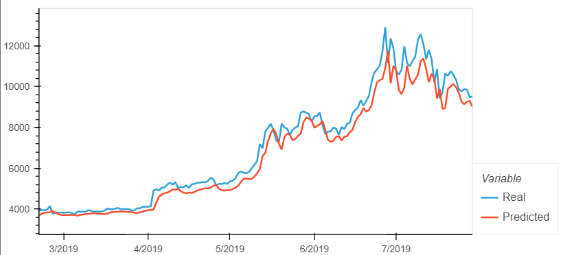
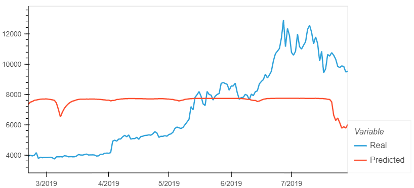
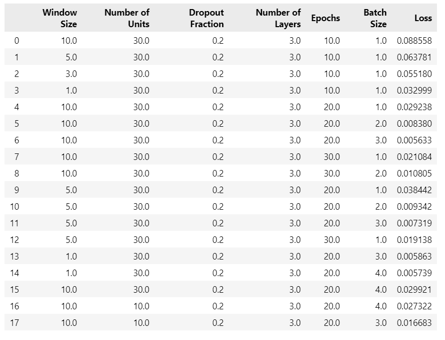
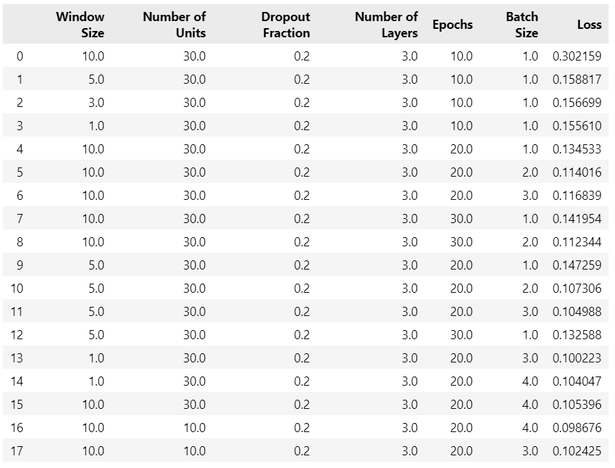

# LSTM Stock Predictor
This project models bitcoin closing prices using deep learning recurrent neural networks (RNN).
It includes two Jupyter notebooks, one for each type of model used. The Crypto Fear and Greed Index (FNG), is used by one of the models to predict the closing price. The other model uses a closing prices window to make a prediction on the nth closing price. Below are the summary of how the models were used in this analysis and the findings.

## Summary of The Models
**Closing Prices and FNG:**

Both the closing prices and FNG models were setup the same way. First, the data was prepared for training and testing. 70% of the data was used for training and the remaining 30% was used for testing. The data was scaled using MinMaxScaler.
Next, custom LSTM RNNs were built and trained. The closing prices were used to fit the model data in the closing prices model, and the FNG values were used to fit the model data in the FNG model. In order to properly compare the models, the same parameters and architecture were used for both models.
Then, the performance of each model was evaluated using the testing data.

## Summary of The Findings
**Closing Prices and FNG:**

The performance of the models was clearly different, with the closing prices model doing much better than the FNG model. The parameters that were changed in order to find the best performance for a particular model and between the two models included: window size, number of units, epochs, and batch size. The architecture that stayed constant was the dropout fraction of 0.2, and the number of layers of 3.

For the closing prices model the loss was always less than that of the FNG model for any given setup of parameters and architecture. The closing prices model also tracked the actual values better over time as can be seen in the following example of a plot of real vs predicted closing values.

Whereas the following plot of the real vs predicted values using the FNG model did poorly at tracking the actual values over time. 

The window size of 10 worked best for the closing prices model as it resulted in the least loss value of 0.005633 for the model for specific parameters that were: number of units = 30, dropout fraction = 0.2, number of layers = 3, epochs = 20, batch size = 3. Below are screenshots of the model evaluation DataFrames that were populated as each test was run.

Closing Prices Model Evaluation:

FNG Model Evaluation:
